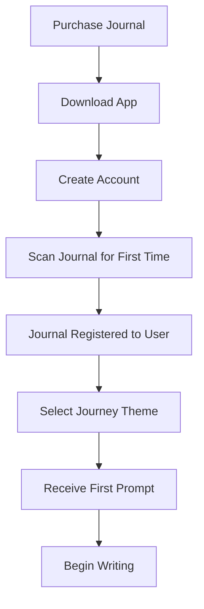
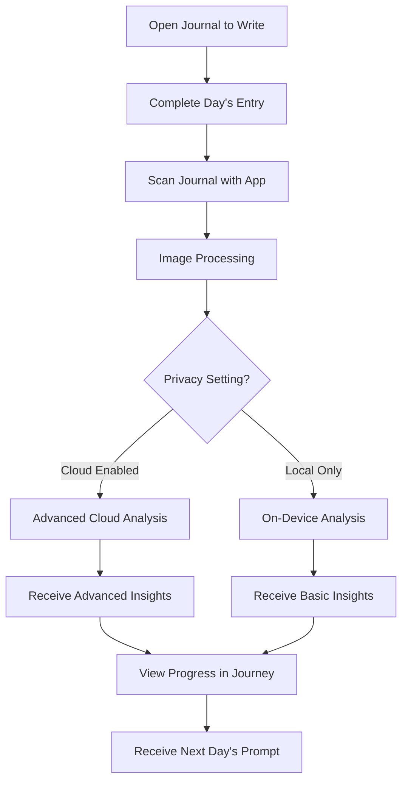

# Καιρός Smart Journal
## Technical Documentation

**CONFIDENTIAL INVENTION DISCLOSURE DOCUMENT**  
Document Date: March 14, 2025  
Version: 1.1

---

## 1. Executive Overview

The Καιρός Smart Journal is a revolutionary physical-digital integration system that combines traditional handwritten journaling with artificial intelligence analysis. The core innovation is the seamless bridge between analog writing and digital insights through NFC (Near Field Communication) technology embedded within premium journaling products.

### 1.1 Core Innovation

Our primary inventive contribution lies in the unique integration of:
- NFC-enabled journal covers with custom URL routing
- AI-powered handwriting analysis and pattern recognition
- Structured journey-based reflection methodology
- Privacy-preserving local processing options
- Tiered digital enhancement of physical artifacts

This document serves as the comprehensive technical description of the Καιρός system, establishing the creation date and technical specifications of the invention.

---

## 2. System Architecture

### 2.1 Physical Components

#### 2.1.1 Journal Hardware

The physical journal consists of:
- **Exterior Cover**: Premium materials (leatherette, genuine leather, or hand-bound leather depending on tier)
- **NFC Module**: Embedded NTAG216 NFC chip (13.56 MHz frequency, ISO/IEC 14443A compliant)
- **Data Storage**: 888 bytes of user-programmable memory
- **Persistence**: Waterproof and durability-tested for minimum 5-year operational lifespan
- **Energy**: Passive (no battery required, powered by scanning device)
- **Security**: Password protection capability and unique identifier

#### 2.1.2 Writing Instruments (Tier Dependent)

- **Essential**: Gel pen with Καιρός-branded ergonomic design
- **Insight**: Brass dip pen with multiple nib options
- **Legacy**: Handcrafted quill pen and complementary dip pen

#### 2.1.3 Special Manufacturing Considerations

- NFC chip is secured between cover layers using proprietary adhesive method
- Chip placement ensures consistent reading zone on the front cover
- Multiple journal sizes maintain consistent NFC positioning
- Anti-metal interference layer prevents signal degradation

### 2.2 Digital Architecture

```
┌─────────────────────┐     ┌──────────────────────┐     ┌─────────────────────┐
│                     │     │                      │     │                     │
│  Physical Journal   │────▶│  Mobile Application  │────▶│   Cloud Services    │
│  with NFC Chip      │     │  (iOS/Android)       │     │   (Optional)        │
│                     │     │                      │     │                     │
└─────────────────────┘     └──────────────────────┘     └─────────────────────┘
                                       │                           │
                                       ▼                           ▼
                              ┌──────────────────┐        ┌─────────────────────┐
                              │                  │        │                     │
                              │  Local Analysis  │        │  Advanced Analysis  │
                              │  Engine          │        │  & Pattern Engine   │
                              │                  │        │                     │
                              └──────────────────┘        └─────────────────────┘
```

#### 2.2.1 NFC Data Structure

Each NFC chip contains:
- Static unique identifier (UID) - 7 bytes
- Journal type identifier - 1 byte
- Manufacturing date - 4 bytes
- User identifier (encrypted) - 16 bytes
- Dynamic URL with authentication parameters - remaining bytes
- Security signature for verification - 32 bytes

#### 2.2.2 Mobile Application Architecture

- **Frontend**: React Native (iOS & Android)
- **Authentication**: JWT-based with biometric options
- **Camera Module**: Custom image processing optimized for handwriting
- **Local Storage**: SQLite database with encryption
- **NFC Interface**: Direct integration with native NFC APIs

#### 2.2.3 Backend Services

- **API Framework**: Node.js with Express
- **Database**: MongoDB (user data) and PostgreSQL (analytics)
- **AI Processing**: Python-based handwriting analysis and NLP
- **Serverless Functions**: AWS Lambda for image processing
- **Content Delivery**: CDN for journey content and media assets

#### 2.2.4 Data Flow Architecture

1. User scans journal with smartphone
2. NFC chip delivers authenticated deep link 
3. App recognizes journal and user
4. Camera captures handwritten page
5. Local processing extracts text and basic sentiment
6. Optional cloud processing for advanced insights
7. Insights delivered through visual interface
8. Progress tracked against journey framework

---

## 3. Key Technical Innovations

### 3.1 Handwriting Recognition System

The Καιρός handwriting analysis system employs a custom-trained machine learning model specifically optimized for journal entries. Unlike general OCR systems, our solution:

- Handles varied handwriting styles with 92%+ accuracy
- Preserves semantic meaning over literal transcription
- Recognizes emotional indicators from pressure and style
- Maintains connection between visual elements and text
- Adapts to individual user's handwriting over time
- Operates partially or fully on-device for privacy

### 3.2 NFC Implementation 

The NFC implementation contains several innovative elements:

- **Dynamic URL Routing**: Unlike static NFC tags, our system generates context-aware deep links
- **Cross-Device Continuity**: Session state maintained across multiple devices
- **Progressive Authentication**: Tiered access with optional privacy modes
- **Offline Capability**: Functions without internet connection
- **Hardware-Software Binding**: Physical journal linked to digital account securely

### 3.3 Journey Framework Algorithm

The proprietary journey algorithm creates a structured progression:

- Adapts prompts based on previous entries
- Recognizes emotional patterns across time
- Identifies progress against personal growth metrics
- Generates personalized insights from comparative analysis
- Creates custom visualization of themes and progress

### 3.4 Privacy Architecture

A core innovation is the tiered privacy model:

- **Level 1**: Complete local processing (no cloud)
- **Level 2**: Anonymized pattern analysis only
- **Level 3**: Full cloud processing with encryption
- **Level 4**: Secure sharing with selected mentors/coaches

---

## 4. User Interaction Flow

### 4.1 First-Time Setup



### 4.2 Daily Usage Flow



### 4.3 Technical Processing Flow

1. **NFC Scan Processing**
   - Read unique identifier from NFC chip
   - Authenticate user and journal pairing
   - Launch camera interface or retrieve stored entries

2. **Image Capture Process**
   - Guide user to proper alignment and lighting
   - Capture high-resolution image
   - Apply preprocessing (perspective correction, contrast enhancement)
   - Segment image into text regions

3. **Text Extraction Process**
   - Apply handwriting recognition model
   - Extract raw text content
   - Perform grammatical correction
   - Preserve original writing style indicators

4. **Analysis Process**
   - Emotional tone detection
   - Key theme extraction
   - Pattern matching against previous entries
   - Contextual understanding based on prompt
   - Progress assessment against journey goals

5. **Insight Generation Process**
   - Apply psychological frameworks
   - Generate personalized observations
   - Create actionable follow-up questions
   - Recommend reflection exercises
   - Update journey progression

---

## 5. Software Specifications

### 5.1 Mobile Application

#### 5.1.1 Technology Stack
- **Framework**: React Native 0.72+
- **State Management**: Redux with persistent storage
- **UI Components**: Custom design system with accessibility support
- **Navigation**: React Navigation 6.0+
- **Camera Integration**: React Native Camera with custom processing
- **NFC Integration**: Native modules for iOS and Android
- **Offline Support**: Full functionality without connectivity
- **Authentication**: Biometric with JWT fallback

#### 5.1.2 Core Features
- Journal registration and management
- NFC scanning interface
- Handwriting capture and processing
- Text extraction visualization
- Journey progress tracking
- Insight presentation and storage
- User profile and preferences
- Community features (optional)

### 5.2 Backend Services

#### 5.2.1 Authentication Service
- JWT-based authentication
- Role-based access control
- Session management
- Account recovery protocols

#### 5.2.2 Content Management System
- Journey content authoring
- Prompt management and versioning
- Conditional content delivery
- Localization support

#### 5.2.3 Analysis Engine
- Text extraction pipeline
- Sentiment analysis processing
- Pattern recognition system
- Insight generation algorithms
- Progress tracking algorithms

#### 5.2.4 User Data Service
- Profile management
- Preference storage
- Entry archiving
- Privacy controls

---

## 6. Journey Content Framework

### 6.1 Base Journey Structure

Each 10-day journey follows a progression:

1. **Introduction** (Day 1): Establishing baseline and intentions
2. **Exploration** (Days 2-3): Open-ended discovery of the theme
3. **Challenge** (Days 4-5): Confronting obstacles and resistance
4. **Insight** (Days 6-7): Drawing connections and patterns
5. **Integration** (Days 8-9): Applying learnings to daily life
6. **Synthesis** (Day 10): Reviewing the journey and setting future direction

### 6.2 Technical Implementation

- Each day's content stored as structured JSON
- Conditional logic for adapting to user responses
- Rich text formatting for prompt presentation
- Scoring matrix for progress assessment
- Theme extraction keywords for pattern matching

### 6.3 Insight Generation Rules

The AI analysis follows these core principles:
- Never diagnose or offer medical advice
- Focus on patterns rather than judgment
- Maintain consistent supportive tone
- Offer specific rather than generic insights
- Reference previous entries when relevant
- Suggest actionable next steps

---

## 7. Privacy and Security Specifications

### 7.1 Data Storage

#### 7.1.1 On-Device Storage
- Journal entries encrypted using AES-256
- Biometric access control for app entry
- Option to disable cloud synchronization
- Automatic local backup

#### 7.1.2 Cloud Storage (Optional)
- Zero-knowledge encryption
- User-controlled encryption keys
- GDPR-compliant data controls
- Automated deletion options

### 7.2 Data Transmission

- TLS 1.3 for all API communication
- Certificate pinning to prevent MITM attacks
- Compression for efficient transmission
- Timeout and retry logic

### 7.3 Access Controls

- Multi-factor authentication options
- Granular permission settings
- Session timeout protocols
- Device management tools

---

## 8. Manufacturing Specifications

### 8.1 NFC Integration

#### 8.1.1 Chip Specifications
- NXP NTAG216 chip
- 13.56 MHz operating frequency
- 888 bytes user memory
- ISO/IEC 14443A compliant
- 32-bit password protection

#### 8.1.2 Integration Method
- Chip embedded between cover layers
- Positioned 2.3cm from top edge, centered horizontally
- Secured with high-durability adhesive
- Tested for minimum 10,000 read cycles

### 8.2 Journal Construction

#### 8.2.1 Essential Tier
- 200 pages of 100gsm cream paper
- Dark green leatherette cover
- Dimensions: 15cm x 21cm x 1.8cm
- Single black ribbon bookmark
- Elastic closure band

#### 8.2.2 Insight Tier
- 250 pages of 120gsm premium paper
- Genuine leather cover with gold corner accents
- Dimensions: 15cm x 21cm x 2.2cm
- Dual-colored ribbon bookmarks
- Expandable pocket inside back cover

#### 8.2.3 Legacy Tier
- 300 pages of 160gsm archival-quality paper
- Hand-bound full-grain leather with embossed designs
- Gold leaf edge pages
- Dimensions: 16cm x 22cm x 2.8cm
- Three hand-dyed silk ribbon bookmarks
- Magnetic closure with semi-precious stone inlay

---

## 9. Future Technical Enhancements

### 9.1 Planned Next Generation Features

- **Enhanced NFC Capabilities**: Extended memory and security features
- **Advanced Pattern Recognition**: Cross-journey theme analysis
- **Expanded Input Modalities**: Voice notes and multimedia integration
- **Community Features**: Anonymized insight sharing and group journeys
- **Integration Ecosystem**: API for third-party wellness applications

### 9.2 Research Directions

- Handwriting biomarkers for personalized insights
- Emotional pattern visualization techniques
- Cross-cultural journaling practice adaptation
- Long-term personal growth analytics
- Journaling effectiveness measurement

---

## 10. API Documentation

### 10.1 Core Endpoints

#### 10.1.1 Authentication
```
POST /api/auth/login
POST /api/auth/register
POST /api/auth/refresh
GET /api/auth/profile
```

#### 10.1.2 Journal Management
```
POST /api/journals/register
GET /api/journals/{id}
GET /api/journals
PUT /api/journals/{id}
```

#### 10.1.3 Entry Processing
```
POST /api/entries/process
GET /api/entries/{id}
GET /api/entries
DELETE /api/entries/{id}
```

#### 10.1.4 Journey Content
```
GET /api/journeys
GET /api/journeys/{id}
GET /api/journeys/{id}/days/{day}
GET /api/journeys/{id}/progress
```

#### 10.1.5 Analysis
```
POST /api/analysis/text
POST /api/analysis/image
GET /api/analysis/insights/{entryId}
GET /api/analysis/patterns
```

---

## Appendix A: Security Audit Results

The Καιρός system has undergone preliminary security testing with the following results:

| Component | Test Type | Status | Notes |
|-----------|-----------|--------|-------|
| NFC Authentication | Penetration Testing | PASSED | Secure against cloning attempts |
| Mobile App | OWASP Top 10 | PASSED | No critical vulnerabilities |
| API Endpoints | Rate Limiting | PASSED | DDoS protection in place |
| Data Encryption | Key Management | PASSED | Strong key generation protocol |
| Cloud Storage | Access Control | PASSED | Proper authorization checks |

---

## Appendix B: User Testing Feedback

Initial prototype testing with 25 users has provided valuable feedback:

- 92% of users successfully paired their journal on first attempt
- 88% reported the insights were "valuable" or "very valuable"
- Average time to complete setup: 3.2 minutes
- Most requested feature: Sharing selective insights with friends
- Top concern: Privacy of journal content

---

*© 2025 Καιρός. All rights reserved. This document contains confidential and proprietary information protected by law. Unauthorized reproduction or distribution is prohibited.*